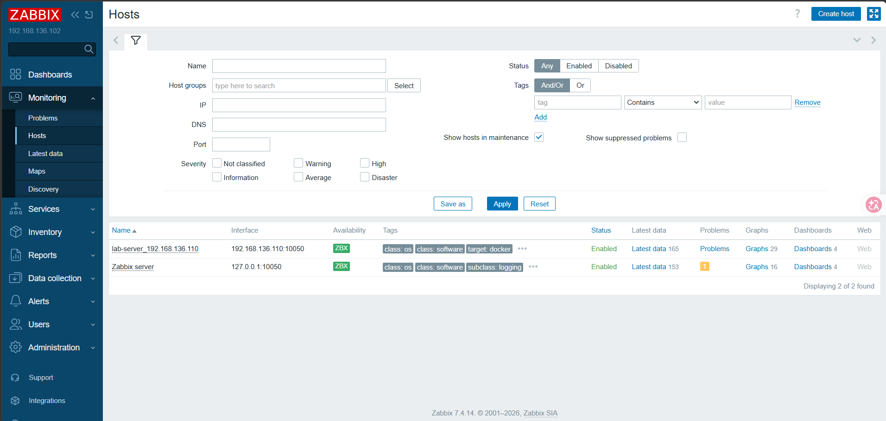
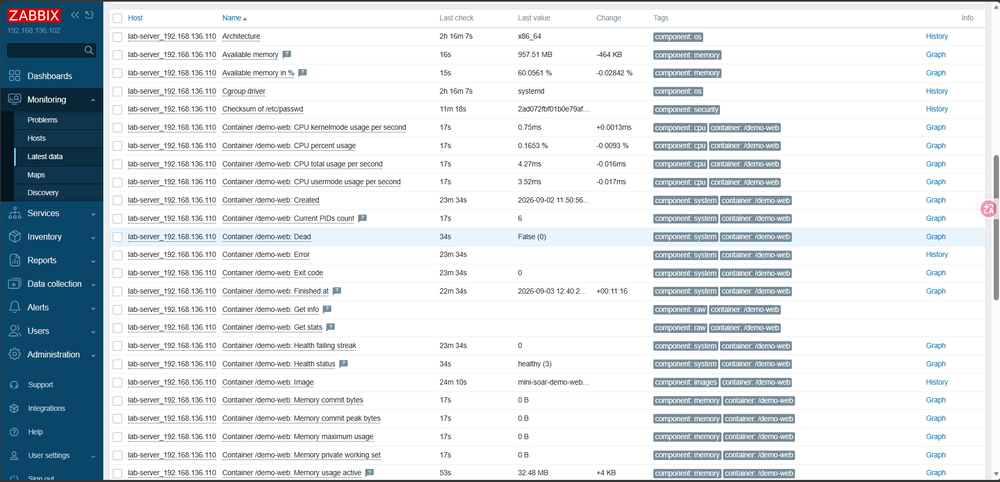
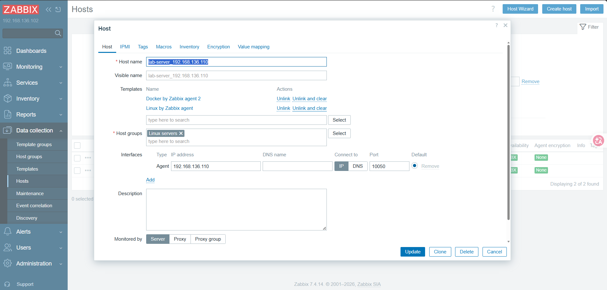
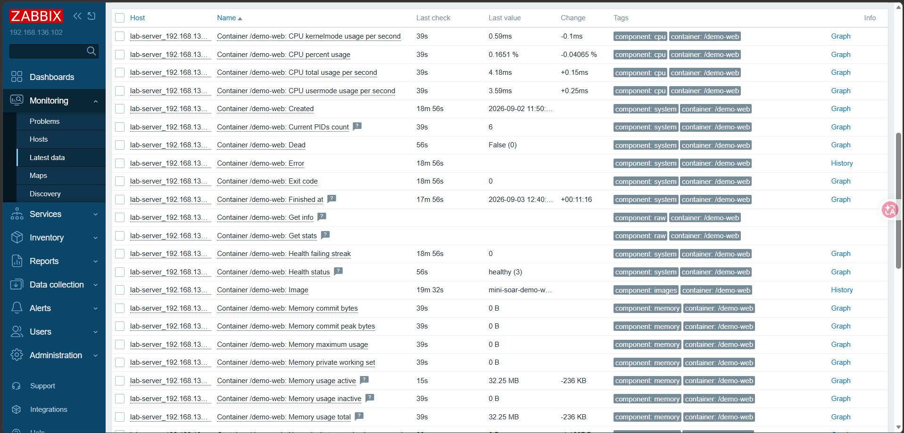
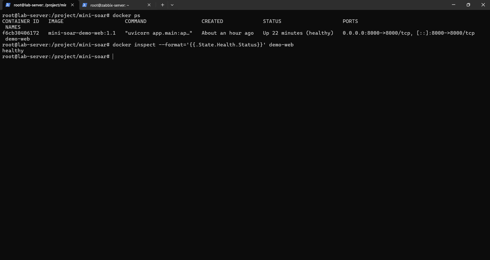
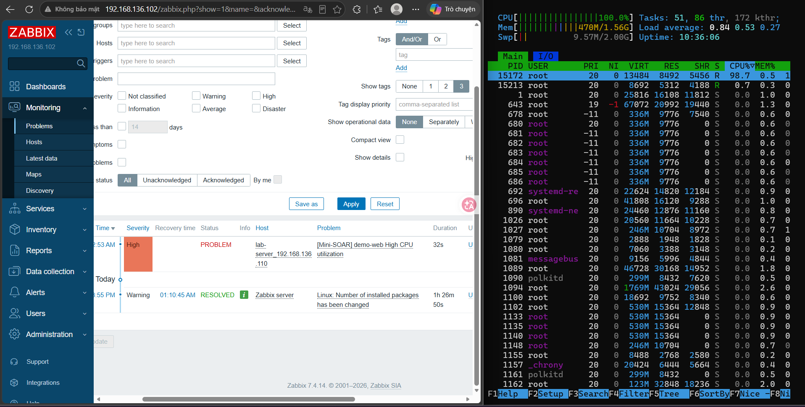
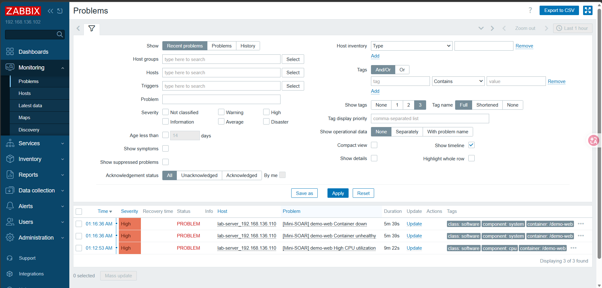
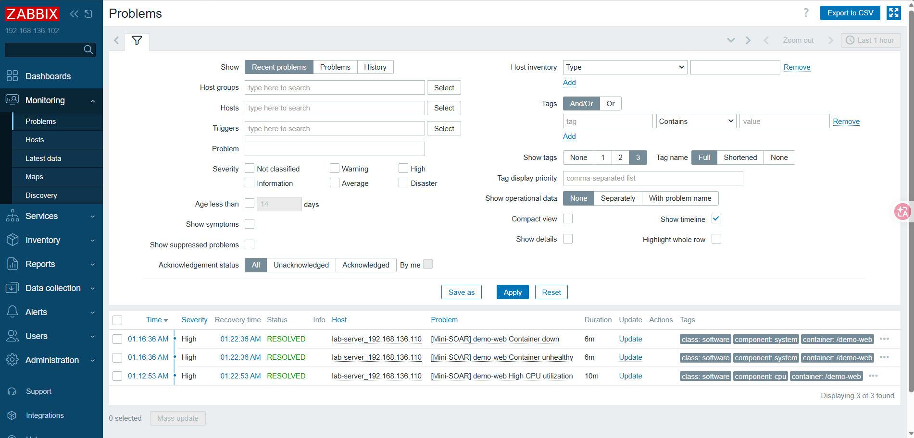

# Mini-SOAR

Mini-SOAR is a portfolio-oriented DevOps and security monitoring lab that demonstrates event-driven infrastructure monitoring, failure detection, and the foundation for future self-healing automation.

## Overview

The project monitors a Linux host and a Dockerized FastAPI workload with Zabbix Agent 2 and Zabbix Server. The current implementation focuses on infrastructure telemetry, Docker container discovery, and reliable detection of CPU and container health incidents.

Mini-SOAR automation, webhook processing, remediation playbooks, incident storage, and alert delivery are planned for later phases and are not yet implemented.

## Key Features

- Linux host monitoring for CPU, memory, disk, and network activity
- Docker monitoring through Zabbix Agent 2
- Docker Low-Level Discovery (LLD), including the monitored `demo-web` container
- Container CPU, memory, running state, health, restart count, and OOMKilled telemetry
- Three custom detection events: `HIGH_CPU`, `CONTAINER_DOWN`, and `CONTAINER_UNHEALTHY`
- Docker health checking through the FastAPI `/health` endpoint
- Controlled failure-simulation scripts for validating Zabbix detection and recovery
- Screenshot-based evidence of monitoring, detection, and event resolution

## Architecture

### Current architecture

```text
Linux / Docker
      |
      v
Zabbix Agent 2
      |
      v
Zabbix Server
      |
      v
Detection Trigger
      |
      v
PROBLEM Event
```

### Planned architecture

The following pipeline is a roadmap target and is not implemented yet:

```text
Zabbix PROBLEM
      |
      v
Webhook
      |
      v
Mini-SOAR Engine
      |
      v
Playbook Engine
      |
      v
Automated Remediation
      |
      v
Verification
      |
      v
Telegram Report
```

See [docs/architecture.md](docs/architecture.md) for the current system boundary and planned evolution.

## Tech Stack

| Area | Technology |
|---|---|
| Host | Linux |
| Application | Python, FastAPI, Uvicorn |
| Containerization | Docker |
| Monitoring agent | Zabbix Agent 2 |
| Monitoring server | Zabbix Server |
| Failure simulation | Bash |
| Version control | Git and GitHub |

MariaDB, Telegram alerting, Jenkins CI/CD, and the Python Mini-SOAR engine are planned for future phases.

## Detection Rules

| Event | Condition | Severity |
|---|---|---|
| `HIGH_CPU` | Average `demo-web` CPU > 80% | High |
| `CONTAINER_DOWN` | Running = false | High |
| `CONTAINER_UNHEALTHY` | Running = true AND Health = unhealthy | High |

The currently configured trigger expressions and expected recovery behavior are documented in [zabbix/triggers.md](zabbix/triggers.md).

## Demo Workload

`demo-web` is a small FastAPI service used as a controlled monitored workload. It exposes:

- `GET /` for basic service information
- `GET /health` for Docker health checks

The container image is built from the root [Dockerfile](Dockerfile) and listens on port `8000`.

## Failure Simulation

The scripts in [`scripts/`](scripts/) reproduce controlled lab failures:

| Script | Simulation | Expected event |
|---|---|---|
| `cpu_spike.sh` | Sustained CPU usage inside `demo-web` | `HIGH_CPU` |
| `container_down.sh` | Stops `demo-web` | `CONTAINER_DOWN` |
| `container_unhealthy.sh` | Creates the lab unhealthy-state flag | `CONTAINER_UNHEALTHY` |

These scripts are intended only for an isolated lab. Review [scripts/README.md](scripts/README.md) before running them.

## Project Structure

```text
mini-soar/
|-- app/
|   `-- main.py
|-- docs/
|   |-- architecture.md
|   |-- environment.md
|   `-- images/
|-- scripts/
|   |-- README.md
|   |-- container_down.sh
|   |-- container_unhealthy.sh
|   `-- cpu_spike.sh
|-- zabbix/
|   |-- templates/
|   |   `-- README.md
|   |-- README.md
|   `-- triggers.md
|-- .dockerignore
|-- .env.example
|-- .gitignore
|-- Dockerfile
|-- LICENSE
|-- README.md
`-- requirements.txt
```

## Screenshots

### Zabbix host monitoring



### Linux metrics



### Docker discovery



### demo-web metrics



### Healthy demo-web container



### HIGH_CPU problem



### Container down and unhealthy problems



### Resolved problems



## Documentation

- [Architecture](docs/architecture.md)
- [Lab environment](docs/environment.md)
- [Zabbix monitoring](zabbix/README.md)
- [Detection rules](zabbix/triggers.md)
- [Failure simulation](scripts/README.md)
- [Zabbix template placeholder](zabbix/templates/README.md)

## Roadmap

| Phase | Scope | Status |
|---|---|---|
| Phase 1 | Infrastructure | Completed |
| Phase 2 | Monitoring & Detection | Completed |
| Phase 3 | Mini-SOAR Engine | Planned / In Progress |
| Phase 4 | Self-Healing Remediation | Planned |
| Phase 5 | Alerting & Incident Storage | Planned |
| Phase 6 | Jenkins CI/CD | Planned |

## Security Considerations

- This project is designed for an isolated lab, not direct production deployment.
- The repository must not contain real passwords, tokens, private keys, or session credentials.
- Local configuration should be stored in an ignored `.env` file; `.env.example` contains placeholders only.
- Access to the Docker socket is highly privileged. Grant it only to trusted accounts and only where required.
- Failure-simulation scripts intentionally disrupt the demo workload and should not be run against production systems.
- Review monitoring and remediation permissions before implementing future automated response actions.

## Project Status

Phases 1 and 2 are complete: the lab infrastructure, monitored workload, telemetry collection, container discovery, detection triggers, and recovery evidence are in place. Phase 3 is planned/in progress; no Mini-SOAR engine, Zabbix webhook handler, automated remediation, Telegram integration, MariaDB incident storage, or Jenkins pipeline is claimed as implemented in this repository.
