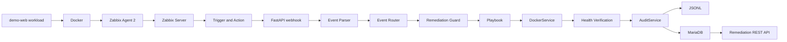

# Mini-SOAR

Mini-SOAR is an event-driven monitoring and self-healing lab that connects Zabbix detection to guarded Docker remediation, health verification, and auditable incident history.

It is a portfolio implementation for DevOps, security automation, and site reliability engineering. The project applies production-oriented design principles, but it is intentionally scoped to an isolated lab and is not presented as production-ready software.

## Overview

Monitoring systems can detect service failures without taking a safe, traceable recovery action. Mini-SOAR demonstrates the next part of that workflow: accept a structured Zabbix event, classify it, enforce remediation policy, perform a narrowly allowed Docker action, verify recovery, and persist the result.

Phases 1 through 4 are implemented:

- Linux and Docker workload infrastructure;
- Zabbix monitoring and detection;
- webhook ingestion, event normalization, and routing;
- automated container remediation, verification, audit persistence, and history APIs.

## Key Features

- Linux and Docker telemetry through Zabbix Agent 2
- Docker Low-Level Discovery that includes the `demo-web` workload when stopped
- Detection for `HIGH_CPU`, `CONTAINER_DOWN`, and `CONTAINER_UNHEALTHY`
- FastAPI webhook ingestion with Pydantic request models
- Explicit handling for Zabbix `PROBLEM` and `RECOVERY` events
- Guarded `docker start` and `docker restart` actions through a dedicated service
- Container allowlist, event deduplication, per-container lock, and cooldown
- Post-remediation running-state and Docker health verification
- JSONL audit records plus MariaDB persistence
- REST endpoints for remediation history and event lookup
- Controlled Bash scripts for repeatable failure injection
- Unit coverage for the remediation guard

## Architecture



The webhook route executes synchronously in the current implementation. `RECOVERY` events are logged and stop at the router; they do not trigger another remediation.

See [the technical architecture](docs/architecture.md) for component boundaries, detailed data flows, and current limitations.

## Tech Stack

| Area | Technology |
|---|---|
| Host and workload | Linux, Docker |
| Monitoring and detection | Zabbix Server, Zabbix Agent 2 |
| Application | Python 3.12, FastAPI, Pydantic, Uvicorn/Gunicorn |
| Remediation | Python subprocess argument lists, Docker CLI |
| Persistence | JSONL, MariaDB, PyMySQL |
| Failure simulation | Bash, curl |
| Source control | Git, GitHub |

Dashboard, notification, and Jenkins capabilities remain roadmap items.

## Detection and Response Policy

| Event | Detection intent | Current response |
|---|---|---|
| `HIGH_CPU` | Sustained `demo-web` CPU utilization above the configured threshold | Investigation-only dry run; no automatic restart |
| `CONTAINER_DOWN` | Docker running state becomes false | Collect evidence, start `demo-web`, then verify it |
| `CONTAINER_UNHEALTHY` | Docker reports the workload as unhealthy | Collect evidence, restart the running container, then verify it |

The `HIGH_CPU` policy is deliberately conservative. High CPU alone does not prove that restarting a service is safe or useful, so Mini-SOAR records the investigation path without taking a disruptive action.

Trigger expressions and required event tags are documented in [zabbix/triggers.md](zabbix/triggers.md).

## Automated Remediation

For container incidents, the router calls the container recovery playbook:

1. Validate that the event identifies a service.
2. Ask the remediation guard to acquire the container.
3. Collect recent container logs as evidence.
4. Start a stopped container or restart an unhealthy running container.
5. Poll Docker until the container is running and its health is `healthy` (or it has no health check).
6. Release the guard and write the outcome to JSONL and MariaDB.

The playbook records `SUCCESS`, `FAILED`, or `ERROR` for attempted remediation. Guard denials are recorded as `SKIPPED` with a reason such as `duplicate_event`, `remediation_in_progress`, or `cooldown_active`.

## Remediation Safety

- Only containers in `DockerService.allowed_containers` can be inspected or changed; the current allowlist contains only `demo-web`.
- Webhook fields are never interpolated into a shell command. Docker commands use fixed argument lists with `shell=False` behavior.
- Docker subprocesses have a 15-second timeout.
- Event IDs are deduplicated in memory for 600 seconds after acquisition.
- A per-container in-memory lock prevents overlapping remediation in the same process.
- A successful remediation starts a 60-second cooldown for that container.
- Every Docker action is followed by running-state and health verification.
- `RECOVERY` events do not invoke remediation.
- JSONL is written before the MariaDB insert, and database exceptions are logged without failing the completed remediation flow.
- Secrets are loaded from environment variables and belong in the ignored `.env` file.

These controls reduce risk inside the lab; they do not replace host isolation, least-privilege Docker access, webhook authentication, or a durable job system.

## Audit and Persistence

Each remediation decision includes:

- timestamp;
- event ID and event type;
- source host and service;
- action and status;
- duration;
- result or skip message.

Local audit records are appended to `logs/remediation.jsonl`. The same decision is inserted into the MariaDB `mini_soar.remediation_history` table defined in [database/schema.sql](database/schema.sql).

The `logs/` directory is runtime data and is ignored by Git.

## REST API

Run the Mini-SOAR engine on the monitored host:

```bash
python -m uvicorn mini_soar.main:app \
  --app-dir src \
  --host 0.0.0.0 \
  --port 9000
```

| Method | Path | Purpose |
|---|---|---|
| `GET` | `/health` | Mini-SOAR process health |
| `POST` | `/api/v1/webhooks/zabbix` | Receive and route a Zabbix event |
| `GET` | `/api/v1/remediations` | List remediation history |
| `GET` | `/api/v1/remediations/{event_id}` | Return the latest record for an event ID |

The list endpoint accepts `limit` (default `20`, range `1`-`100`), `status`, and `event_type`.

```bash
curl -s http://localhost:9000/health

curl -s \
  "http://localhost:9000/api/v1/remediations?limit=5&status=SUCCESS"

curl -s \
  http://localhost:9000/api/v1/remediations/1211
```

Interactive OpenAPI documentation is available at `http://localhost:9000/docs` while the service is running.

## Failure Simulation

Run these scripts only in the isolated lab:

| Command | Injected condition | Expected Mini-SOAR behavior |
|---|---|---|
| `./scripts/container_down.sh` | Stops `demo-web` | Zabbix emits `CONTAINER_DOWN`; Mini-SOAR starts and verifies it |
| `./scripts/container_unhealthy.sh` | Calls the workload's lab-only unhealthy endpoint | Zabbix emits `CONTAINER_UNHEALTHY`; Mini-SOAR restarts and verifies it |
| `./scripts/container_unhealthy_recover.sh` | Clears the in-memory unhealthy state manually | Used only when testing detection without automatic restart |
| `./scripts/cpu_spike.sh` | Starts sustained CPU work inside `demo-web` | Zabbix emits `HIGH_CPU`; Mini-SOAR remains investigation-only |

The unhealthy simulation is in memory. Restarting the workload process resets it; the current implementation does not use a `/tmp/force_unhealthy` flag.

See [scripts/README.md](scripts/README.md) for prerequisites, recovery guidance, and expected results.

## Tests

```bash
python -m compileall src
PYTHONPATH=src python -m unittest discover -s tests -v
```

The current unit tests cover first-event acquisition, duplicate detection, remediation locking, retry after lock release, cooldown enforcement, and retry after cooldown.

## Project Structure

```text
mini-soar/
|-- app/
|   `-- main.py                       # monitored demo workload
|-- database/
|   `-- schema.sql                    # MariaDB audit schema
|-- docs/
|   |-- architecture.md
|   |-- environment.md
|   `-- images/                       # real lab evidence
|-- scripts/
|   |-- README.md
|   |-- container_down.sh
|   |-- container_unhealthy.sh
|   |-- container_unhealthy_recover.sh
|   `-- cpu_spike.sh
|-- src/mini_soar/
|   |-- api/                          # webhook and history routes
|   |-- core/                         # event and response models
|   |-- playbooks/                    # routing and response policy
|   |-- services/                     # Docker, guard, audit, database
|   `-- main.py                       # Mini-SOAR FastAPI application
|-- tests/
|   `-- test_remediation_guard.py
|-- zabbix/
|   |-- templates/
|   |   `-- README.md
|   |-- README.md
|   `-- triggers.md
|-- .dockerignore
|-- .env.example
|-- .gitignore
|-- Dockerfile
|-- LICENSE
|-- README.md
`-- requirements.txt
```

## Demo Evidence

### Monitoring and end-to-end event delivery


### Phase 4 remediation

The following terminal evidence captures a verified restart together with duplicate and cooldown guard decisions:


The unhealthy-container scenario shows `docker restart`, health polling, `SUCCESS`, audit persistence, and duplicate protection:


### Audit persistence and API


Additional Phase 1-3 evidence is available in [docs/images/](docs/images/), including Docker discovery, trigger incidents, webhook configuration, routing, and recovery events.

## Documentation

- [Technical architecture](docs/architecture.md)
- [Lab environment](docs/environment.md)
- [Failure simulation](scripts/README.md)
- [Zabbix monitoring and webhook flow](zabbix/README.md)
- [Zabbix detection rules](zabbix/triggers.md)
- [Zabbix template export policy](zabbix/templates/README.md)

## Roadmap

The following capabilities are planned and are not implemented in the current repository:

- dashboard/frontend consuming the remediation API;
- Telegram or other incident notifications;
- Jenkins CI/CD;
- durable queue or background remediation workers;
- database-backed deduplication and cooldown state;
- retry, backoff, attempt limits, and circuit breaking;
- webhook/API authentication and authorization;
- broader unit, API, and integration test coverage;
- structured metrics and production observability.

## Project Status

| Phase | Scope | Status |
|---|---|---|
| Phase 1 | Infrastructure and monitored workload | Complete |
| Phase 2 | Monitoring and detection | Complete |
| Phase 3 | Event ingestion and routing | Complete |
| Phase 4 | Automated remediation, audit, database, and history API | Complete |
| Phase 5+ | Dashboard, notification, CI/CD, and hardening | Planned |
