# Mini-SOAR

**Event-Driven Security Monitoring & Self-Healing Automation**

## Overview

Mini-SOAR is an isolated DevOps and security automation lab that connects Zabbix detection to guarded Docker remediation, recovery verification, an auditable incident history, REST APIs, a read-only security operations dashboard, Discord outcome notifications, and Jenkins-driven lab delivery.

The project demonstrates a deliberately narrow SOAR workflow for a single monitored workload. It is a portfolio project, not a replacement for an enterprise SOAR platform and not production-ready infrastructure.

The implemented scope includes:

- Linux and Docker workload infrastructure
- Zabbix monitoring and detection
- Webhook ingestion, event normalization, and routing
- Automated container remediation, verification, audit persistence, and history APIs
- A read-only React and TypeScript security operations dashboard
- Discord notifications for attempted remediation outcomes
- Jenkins CI, full-stack integration tests, and direct lab deployment with post-deployment verification and conditional rollback

## Key Features

- Linux and Docker telemetry through Zabbix Agent 2
- Docker Low-Level Discovery that includes the `demo-web` workload when stopped
- Detection for `HIGH_CPU`, `CONTAINER_DOWN`, and `CONTAINER_UNHEALTHY`
- FastAPI webhook ingestion with Pydantic request models
- Explicit handling for Zabbix `PROBLEM` and `RECOVERY` events
- Guarded `docker start` and `docker restart` actions through a dedicated service
- Container allowlist, event deduplication, per-container lock, and cooldown
- Post-remediation running-state and Docker health verification
- JSONL audit records plus MariaDB persistence
- REST endpoints for remediation history, summary, distribution, and event lookup
- React and TypeScript dashboard with KPIs, filters, analytics, and refresh controls
- Discord webhook notifications for `SUCCESS`, `FAILED`, and `ERROR` remediation outcomes
- Notification failure isolation from the remediation pipeline
- Three build-numbered Docker images and Compose-based CI/deployment stacks
- Jenkins SCM polling, backend validation, frontend build, API smoke tests, and self-healing integration tests
- Build-once deployment of the tested images with SHA256 verification and `docker compose --no-build`
- Post-deployment health/image checks and automatic metadata-based rollback on deployment failure
- Controlled Bash scripts for repeatable failure injection
- Unit coverage for the remediation guard

## Architecture

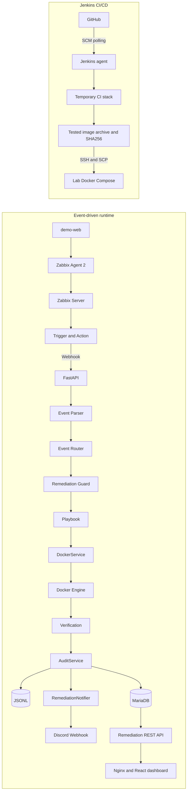

The dashboard is separate from the automation path. It reads persisted remediation data and has no control that starts or restarts a container, invokes a playbook, or executes a shell command. Discord is an external, outbound notification channel and cannot control remediation.

The webhook route executes synchronously in the current implementation. `RECOVERY` events are logged and stop at the router; they do not trigger remediation.

See [the technical architecture](docs/architecture.md) for component boundaries, detailed data flows, and current limitations.

## Technology Stack

| Area | Technology |
|---|---|
| Monitoring | Zabbix Server, Zabbix Agent 2 |
| Backend | Python, FastAPI, Pydantic, Uvicorn/Gunicorn |
| Frontend | React, TypeScript, Vite |
| Database | MariaDB, PyMySQL, JSONL audit |
| Containerization | Docker, Docker Compose, Docker CLI |
| CI/CD | Jenkins declarative pipeline, Git SCM polling, SSH/SCP |
| Web server | Nginx for the deployed dashboard and API proxy |
| Notifications | Discord Webhook |
| OS / infrastructure | Linux lab hosts, Bash, Git/GitHub |

## Event Flow

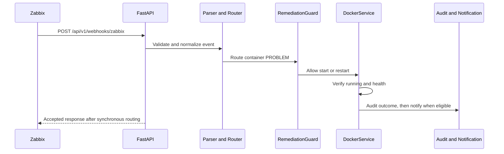

## Event Types

| Event | Detection intent | Current response |
|---|---|---|
| `HIGH_CPU` | Sustained `demo-web` CPU utilization above the configured threshold | Investigation-only dry run; logs intent but does not restart or write a remediation record |
| `CONTAINER_DOWN` | Docker running state becomes false | Collect evidence, start `demo-web`, then verify it |
| `CONTAINER_UNHEALTHY` | Docker reports the workload as unhealthy | Collect evidence, restart the running container, then verify it |

The `HIGH_CPU` policy is deliberately conservative. High CPU alone does not prove that restarting a service is safe or useful, so Mini-SOAR records the investigation path without taking a disruptive action.

Trigger expressions and required event tags are documented in [zabbix/triggers.md](zabbix/triggers.md).

## Self-Healing Workflow

For container `PROBLEM` events, the router calls the container recovery playbook:

1. Validate that the event identifies a service.
2. Ask the remediation guard to acquire the event/container pair.
3. Collect the last 50 lines of container logs as pre-remediation evidence.
4. For `CONTAINER_DOWN`, start the container only if it is stopped.
5. For `CONTAINER_UNHEALTHY`, restart it if running or defensively start it if it stopped before handling.
6. Poll Docker for up to 90 seconds until the container is running and its health is `healthy` (or it has no health check).
7. Release the remediation guard.
8. Write the outcome to JSONL and MariaDB.
9. For `SUCCESS`, `FAILED`, or `ERROR`, attempt a Discord notification after the audit call returns.

The playbook records `SUCCESS`, `FAILED`, or `ERROR` for attempted remediation. Guard denials are recorded as `SKIPPED` with a reason such as `duplicate_event`, `remediation_in_progress`, or `cooldown_active`.

### Safety Controls

- Only containers in `DockerService.allowed_containers` can be inspected or changed; the current allowlist contains only `demo-web`.
- Webhook fields are never interpolated into a shell command. Docker commands use fixed argument lists, and the API exposes no arbitrary shell execution.
- Docker subprocesses have a 15-second timeout.
- Event IDs are deduplicated in memory for 600 seconds after acquisition.
- A per-container in-memory lock prevents overlapping remediation in the same process.
- A successful remediation starts a 60-second cooldown for that container.
- Every Docker action is followed by running-state and health verification.
- `RECOVERY` events do not invoke remediation.
- JSONL is written before the MariaDB insert, and database exceptions are logged without failing the completed remediation flow.
- Discord delivery errors are contained by the notification service and notifier; they do not change the remediation result.
- Secrets are loaded from environment variables and belong in the ignored `.env` file.

These controls reduce risk inside the lab; they do not replace host isolation, least-privilege Docker access, webhook authentication, or a durable job system.

See [Self-Healing Workflows](docs/self-healing.md) for event-specific sequences, guard semantics, outcomes, and limitations.

## Remediation Guard

The in-memory guard applies its checks atomically within the current Python process:

- **Duplicate event:** retains an acquired `event_id` for 600 seconds.
- **In progress:** permits only one active remediation for a container.
- **Cooldown:** blocks new remediation for 60 seconds after a successful verified recovery.
- **Event TTL:** removes expired event IDs from the deduplication set.

Events denied by the in-progress or cooldown checks are not consumed, so they can be retried later. Guard state is not durable and is not shared across multiple worker processes.

## Audit and Persistence

Each remediation decision includes:

- timestamp;
- event ID and event type;
- source host and service;
- action and status;
- duration;
- result or skip message.

Workflow status values are `SUCCESS`, `FAILED`, `ERROR`, and `SKIPPED`.

Local audit records are appended to `logs/remediation.jsonl`. The same decision is inserted into the MariaDB `mini_soar.remediation_history` table defined in [database/schema.sql](database/schema.sql).

The `logs/` directory is runtime data and is ignored by Git.

## Notifications

Mini-SOAR can send attempted remediation outcomes to Discord through a configurable webhook. Notification is evaluated only after the remediation guard has been released and the audit service has written the JSONL record and attempted MariaDB persistence.

| Remediation status | Discord notification |
|---|---|
| `SUCCESS` | Yes |
| `FAILED` | Yes |
| `ERROR` | Yes |
| `SKIPPED` | No |

`SKIPPED` decisions include duplicate events, an active cooldown, and another remediation already in progress. Suppressing these notifications reduces repeated messages and alert fatigue while the decisions remain available in the audit trail.

Discord embeds include:

- event ID and event type;
- service, host, action, and status;
- remediation duration;
- details when a result message is available.

The embed title identifies the remediation status, and its description identifies the event ID. Detail text is limited to 1,000 characters by the implementation.

### Failure Isolation

Notification delivery is deliberately isolated from remediation. `NotificationService` returns a structured result for disabled notifications, non-notifiable statuses, missing configuration, successful delivery, HTTP errors, connection errors, and unexpected errors. Discord requests use a five-second HTTP timeout.

`RemediationNotifier` adds a second exception boundary so notification failures do not propagate into the remediation workflow. If Discord is unavailable, the webhook is invalid, a request times out, or Discord returns an HTTP error:

- the established remediation status is not changed;
- the preceding audit work is not rolled back;
- the Mini-SOAR remediation pipeline does not fail solely because notification delivery failed.

There is no retry mechanism, persistent notification queue, or acknowledgement workflow in the current implementation.

## REST API

Run the Mini-SOAR engine on the monitored host:

```bash
python -m uvicorn mini_soar.main:app \
  --app-dir src \
  --host 0.0.0.0 \
  --port 9000
```

| Method | Path | Purpose |
|---|---|---|
| `GET` | `/health` | Mini-SOAR process health |
| `POST` | `/api/v1/webhooks/zabbix` | Receive and route a Zabbix event |
| `GET` | `/api/v1/remediations` | List remediation history with optional `limit`, `status`, and `event_type` filters |
| `GET` | `/api/v1/remediations/summary` | Return totals, outcome counts, success rate, and average successful-remediation duration |
| `GET` | `/api/v1/remediations/distribution` | Return counts grouped by status and event type |
| `GET` | `/api/v1/remediations/{event_id}` | Return the latest record for an event ID |

The list endpoint accepts `limit` (default `20`, range `1`-`100`), `status`, and `event_type`.

```bash
curl -s http://localhost:9000/health

curl -s \
  "http://localhost:9000/api/v1/remediations?limit=5&status=SUCCESS"

curl -s \
  http://localhost:9000/api/v1/remediations/1211
```

Interactive OpenAPI documentation is available at `http://localhost:9000/docs` while the service is running.

MariaDB query failures are returned as HTTP `503`; an unknown event ID returns HTTP `404`.

## Security Operations Dashboard

Phase 5 adds a responsive dark dashboard in `frontend/`, implemented with React and TypeScript. It provides:

- KPI cards for Total Incidents, Success Rate, Skipped, and Average Remediation Duration
- The 10 most recent remediation records
- Status and event-type filters for the history table
- Manual refresh and automatic refresh every 15 seconds
- Last-updated timestamp
- Status and event-type distribution charts
- An `Operational` or `API Unavailable` indicator based on the dashboard data requests
- Loading, error, and empty-data states

The summary and distribution describe all persisted remediation records; the selected filters apply to the recent-history request. The average duration is calculated from successful remediations only.

The dashboard is intentionally **read-only**. It does not expose browser-triggered remediation, playbook execution, container control, or shell execution.

## Dashboard Architecture

```text
MariaDB
   |
   v
FastAPI REST API :9000
   |
   v
Vite development proxy :5173
   |
   v
React/TypeScript dashboard
```

During development, Vite proxies `/api` and `/health` to `http://127.0.0.1:9000`. The dashboard data service uses the `/api/v1` routes. The proxy is development convenience, not an authentication or authorization boundary.

## CI/CD Pipeline

Jenkins runs the repository pipeline on an agent labeled `ci` and detects revisions with SCM polling approximately every two minutes. It does not use a GitHub webhook.

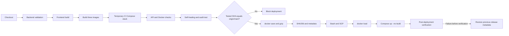

The CI stack exposes `demo-web`, the API, and dashboard on `18000`, `19000`, and `18080`, with a temporary MariaDB service and notifications disabled. It validates OpenAPI, database access, Nginx proxying, Docker socket compatibility, a synthetic `CONTAINER_DOWN` recovery, and persisted `SUCCESS/action=start` audit data.

The three build-numbered images are built once, tested, packaged into one archive, verified with SHA256 on the target, loaded, and deployed without rebuilding. See [CI/CD Pipeline](docs/ci-cd.md) for the exact 21-stage order and cleanup behavior.

## Deployment Architecture

Jenkins transfers artifacts over SSH/SCP as `mini-soar-deploy` to the lab host `192.168.136.110:/opt/mini-soar`. The deployment host keeps its own `.env`; Jenkins transfers only the image archive, checksum, Compose file, image-tag file, and non-secret release metadata.

The deployed Compose stack contains:

- `demo-web` on port `8000`;
- `mini-soar-api` on host networking at port `9000`, with the Docker socket mounted;
- `mini-soar-dashboard` served by Nginx on port `8080` with `/api` reverse proxying.

Post-deployment checks cover service health, API/database access, reverse proxying, exact image tags, and build metadata. If deployment has started but verification has not completed, Jenkins attempts to restore the previous Compose and image-tag metadata with `--no-build`. See [Lab Deployment](docs/deployment.md) for prerequisites and rollback limits.

## Demo Scenario

> **For isolated lab/demo use only.** Do not expose or copy these simulation mechanisms into production workloads.

Run these scripts only in the isolated lab:

| Command | Injected condition | Expected Mini-SOAR behavior |
|---|---|---|
| `./scripts/container_down.sh` | Stops `demo-web` | Zabbix emits `CONTAINER_DOWN`; Mini-SOAR starts and verifies it |
| `./scripts/container_unhealthy.sh` | Calls the workload's lab-only unhealthy endpoint | Zabbix emits `CONTAINER_UNHEALTHY`; Mini-SOAR restarts and verifies it |
| `./scripts/container_unhealthy_recover.sh` | Clears the in-memory unhealthy state manually | Used only when testing detection without automatic restart |
| `./scripts/cpu_spike.sh` | Starts sustained CPU work inside `demo-web` | Zabbix emits `HIGH_CPU`; Mini-SOAR remains investigation-only |

The workload also exposes `POST /simulate/unhealthy`, `POST /simulate/recover`, and `GET /simulate/status` for the controlled unhealthy scenario.

The unhealthy simulation is in memory. Restarting the workload process resets it; the current implementation does not use a `/tmp/force_unhealthy` flag.

See [scripts/README.md](scripts/README.md) for prerequisites, recovery guidance, and expected results.

For a recruiter-friendly 3-5 minute walkthrough, including the CI/CD evidence sequence, see [Demo Runbook](docs/demo.md).

## Tests

```bash
python -m compileall src
PYTHONPATH=src python -m unittest discover -s tests -v
```

The current unit tests cover first-event acquisition, duplicate detection, remediation locking, retry after lock release, cooldown enforcement, and retry after cooldown.

## Project Structure

```text
mini-soar/
|-- app/
|   `-- main.py                       # monitored demo workload
|-- database/
|   `-- schema.sql                    # MariaDB audit schema
|-- docs/
|   |-- architecture.md
|   |-- ci-cd.md
|   |-- demo.md
|   |-- deployment.md
|   |-- environment.md
|   |-- security.md
|   |-- self-healing.md
|   `-- images/                       # real lab evidence
|-- docker/
|   |-- demo-web.Dockerfile
|   `-- mini-soar.Dockerfile
|-- frontend/
|   |-- src/
|   |   |-- components/               # cards, charts, and history table
|   |   |-- pages/                    # dashboard and refresh state
|   |   |-- services/                 # REST API client
|   |   `-- types/                    # API response types
|   |-- Dockerfile                    # multi-stage Vite/Nginx image
|   |-- nginx/
|   |   `-- default.conf.template     # SPA and /api reverse proxy
|   |-- package.json
|   `-- vite.config.ts
|-- scripts/
|   |-- README.md
|   |-- container_down.sh
|   |-- container_unhealthy.sh
|   |-- container_unhealthy_recover.sh
|   `-- cpu_spike.sh
|-- src/mini_soar/
|   |-- api/                          # webhook and history routes
|   |-- core/                         # event and response models
|   |-- playbooks/                    # routing and response policy
|   |-- services/                     # Docker, guard, audit, database, notifications
|   `-- main.py                       # Mini-SOAR FastAPI application
|-- tests/
|   `-- test_remediation_guard.py
|-- zabbix/
|   |-- templates/
|   |   `-- README.md
|   |-- README.md
|   `-- triggers.md
|-- .dockerignore
|-- .env.example
|-- .gitignore
|-- docker-compose.ci.yml             # isolated CI integration stack
|-- docker-compose.yml                # deployed lab stack
|-- Jenkinsfile                       # build, test, deploy, and rollback
|-- LICENSE
|-- README.md
`-- requirements.txt
```

Generated frontend dependencies and builds (`frontend/node_modules/` and `frontend/dist/`) are ignored and are not part of the project tree.

## Prerequisites

- Linux
- Docker
- Python
- MariaDB
- Node.js and npm
- Zabbix Server and Zabbix Agent 2

## Environment Variables

Copy `.env.example` to the ignored `.env` file and provide local values. The backend reads these database variables:

- `DB_HOST`
- `DB_PORT`
- `DB_NAME`
- `DB_USER`
- `DB_PASSWORD`

Notification configuration uses:

| Variable | Purpose |
|---|---|
| `NOTIFICATIONS_ENABLED` | Enables notifications only when its normalized value is `true`; defaults to disabled |
| `DISCORD_WEBHOOK_URL` | Discord webhook used for outbound remediation notifications |

Safe disabled configuration:

```env
NOTIFICATIONS_ENABLED=false
DISCORD_WEBHOOK_URL=
```

Do not commit a real Discord webhook URL. When notifications are disabled or the URL is not configured, the service returns a non-success result and remediation continues.

## Backend Development

```bash
python -m venv .venv
source .venv/bin/activate
python -m pip install -r requirements.txt

python -m uvicorn mini_soar.main:app \
  --app-dir src \
  --host 0.0.0.0 \
  --port 9000
```

## Frontend Development

With the backend listening on the same development machine at `127.0.0.1:9000`:

```bash
cd frontend
npm install
npm run dev
```

Open `http://localhost:5173`. Build the static assets with:

```bash
npm run build
```

The deployed dashboard image builds the Vite assets and serves them through Nginx. Its `/api/` location proxies to the Mini-SOAR API, while `/healthz` supports service verification.

## API and Dashboard Development Flow

```text
Browser -> Vite :5173 -> /api proxy -> FastAPI :9000 -> MariaDB
```

## Screenshots

### Phase 6 Discord notification

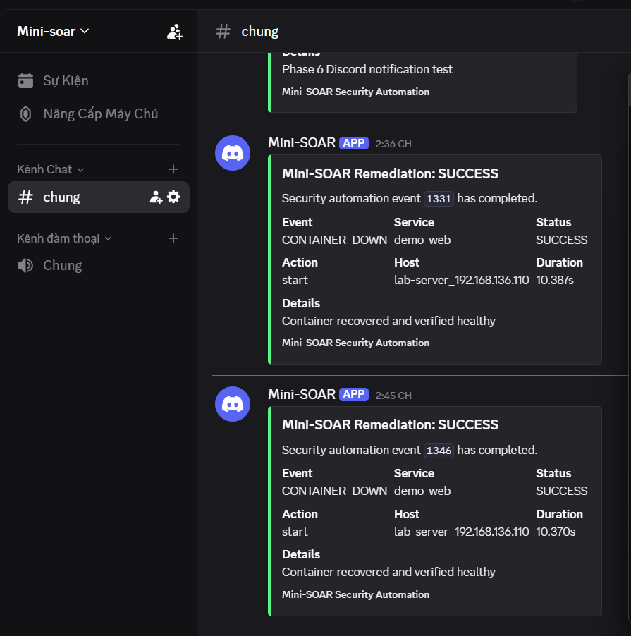

### Phase 5 dashboard

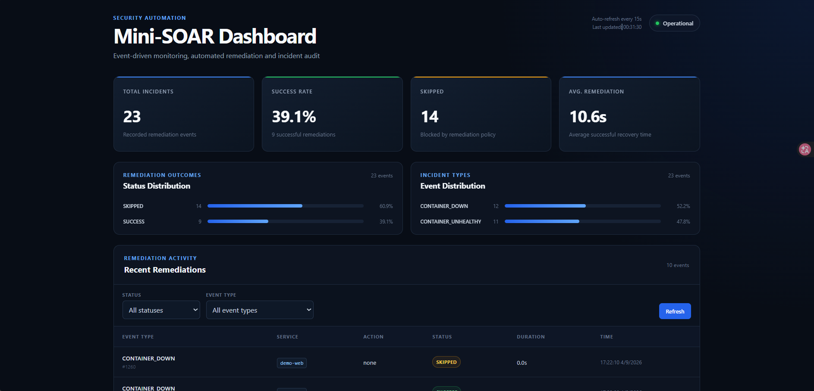

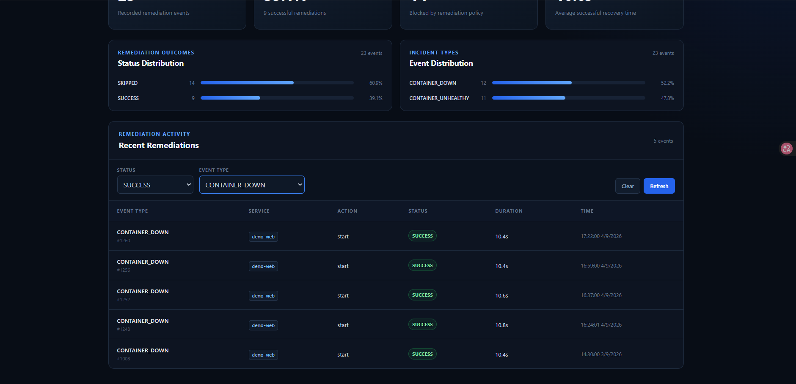

### Monitoring and end-to-end event delivery


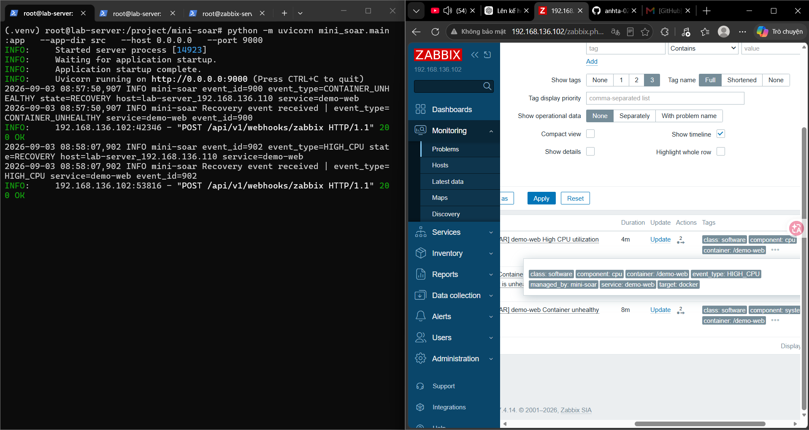

### Phase 4 remediation

The following terminal evidence captures a verified restart together with duplicate and cooldown guard decisions:

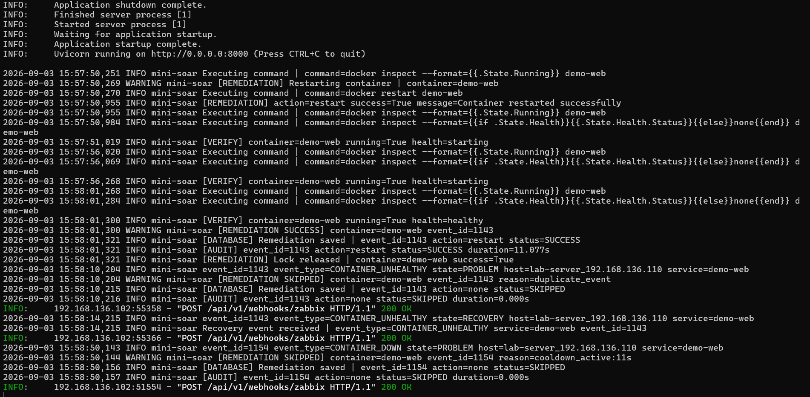

The unhealthy-container scenario shows `docker restart`, health polling, `SUCCESS`, audit persistence, and duplicate protection:

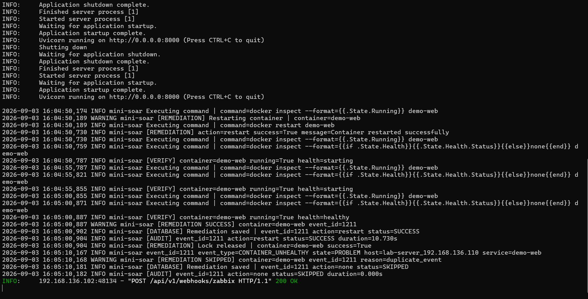

### Audit persistence and API

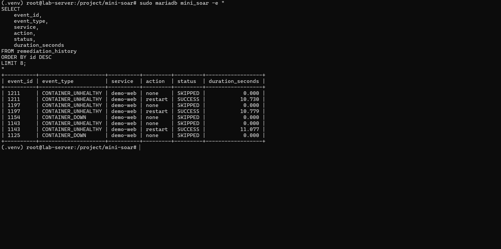

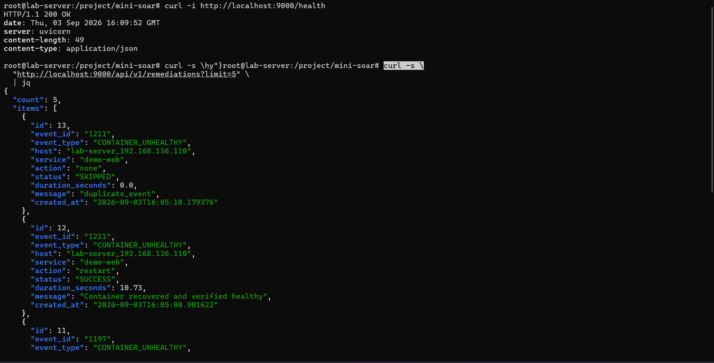

Additional Phase 1-3 evidence is available in [docs/images/](docs/images/), including Docker discovery, trigger incidents, webhook configuration, routing, and recovery events.

### Jenkins CI/CD

The two captures below show the left and right halves of successful Jenkins build `#16`, including validation, integration testing, deployment, post-deployment verification, and finalization.

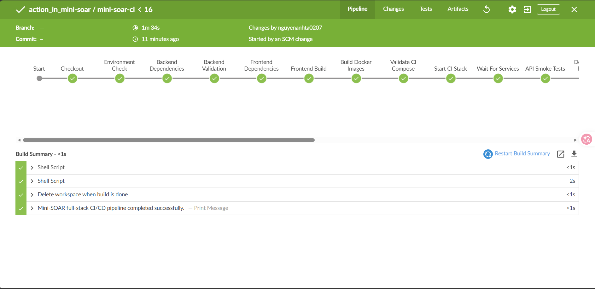

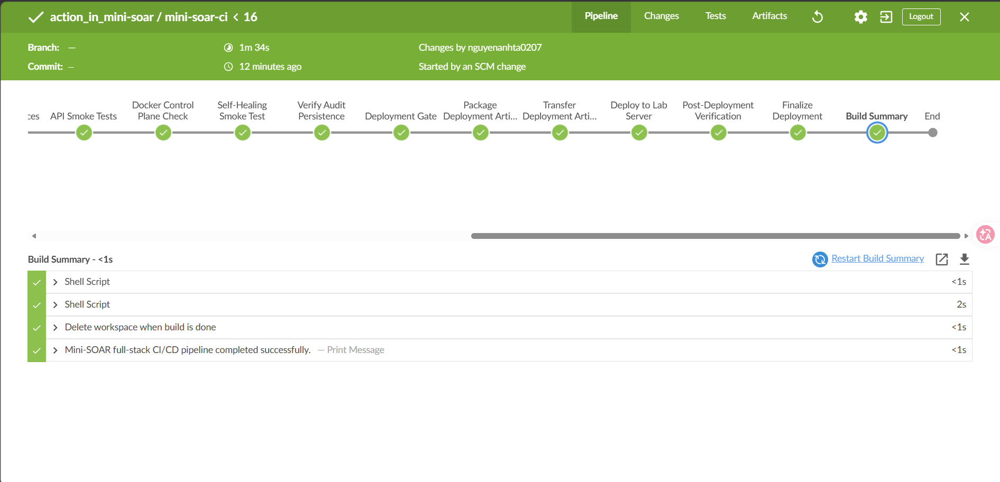

### Deployment state

The deployment evidence shows all three build `#16` images running healthy and the corresponding non-secret release metadata.

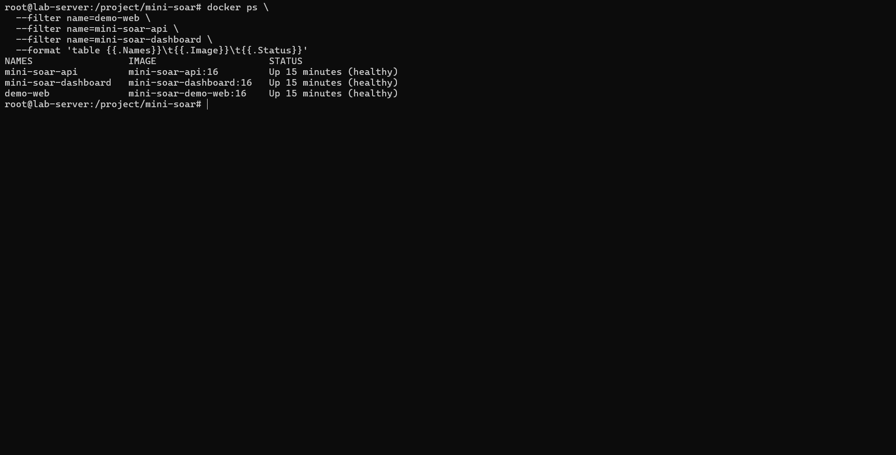

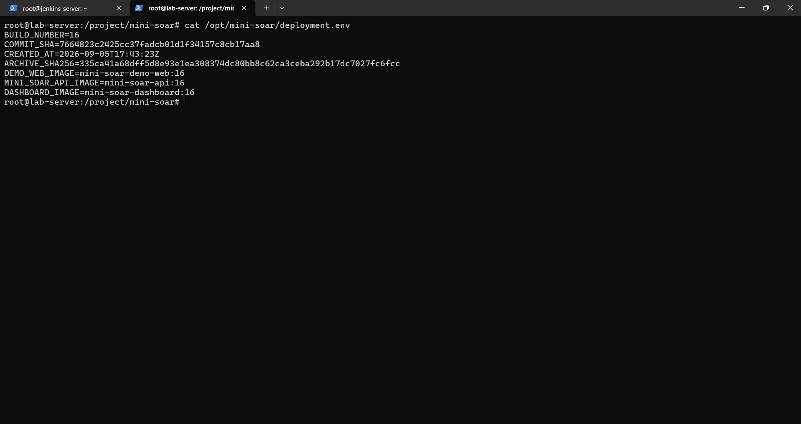

See the [Demo Runbook](docs/demo.md) for the complete evidence checklist and capture guidance.

## Documentation

- [Technical architecture](docs/architecture.md)
- [Self-healing design](docs/self-healing.md)
- [CI/CD pipeline](docs/ci-cd.md)
- [Lab deployment](docs/deployment.md)
- [Lab environment](docs/environment.md)
- [Security model and limitations](docs/security.md)
- [Demo runbook and evidence checklist](docs/demo.md)
- [Failure simulation](scripts/README.md)
- [Zabbix monitoring and webhook flow](zabbix/README.md)
- [Zabbix detection rules](zabbix/triggers.md)
- [Zabbix template export policy](zabbix/templates/README.md)

## Security Considerations

- The container allowlist restricts the current remediation target to `demo-web`.
- Docker operations use argument lists rather than shell-evaluated webhook input.
- SQL values use PyMySQL parameters.
- Secrets are loaded from environment variables; `.env.example` contains placeholders only.
- `.env`, virtual environments, Python caches, runtime logs, frontend dependencies, and frontend builds are ignored by Git.
- The dashboard is read-only and has no direct Docker or playbook control.
- Discord is an outbound notification channel only and has no remediation control path.
- The Discord webhook is read from the ignored local environment and must not be committed.
- Notification failures are contained and cannot overwrite a completed remediation result.
- Jenkins deploys only when the tested commit exactly matches `origin/main`, verifies the artifact checksum, and reuses the tested image archives with `--no-build`.
- SSH deployment uses a dedicated lab account, stored Jenkins credentials, batch mode, and strict host-key checking.
- The Python webhook handler consumes `event_type` and `service` tags but does not enforce `managed_by`; intended-event filtering must be applied in Zabbix and at the network boundary.
- The webhook and remediation history APIs currently have no authentication or authorization.
- Docker socket access and deploy-account membership in the Docker group are effectively host-level privileges. This lab architecture is not hardened production infrastructure.

See [Security Model and Limitations](docs/security.md) for trust boundaries, secret-handling guidance, and residual risks.

## Future Improvements

### Completed

- Monitoring and Docker workload discovery
- Zabbix detection and webhook delivery
- Event normalization and routing
- Guarded automated remediation and verification
- JSONL and MariaDB audit persistence
- Remediation REST APIs
- Read-only React/TypeScript security operations dashboard
- Discord remediation outcome notifications with failure isolation
- Jenkins validation, integration tests, immutable artifact transfer, lab deployment, post-deployment verification, and conditional rollback

### Candidate hardening

- Webhook/API authentication and authorization
- Durable workers, persistent guard state, retry/backoff, and circuit breaking
- A private image registry, image signing, SBOM generation, and vulnerability policy gates
- Managed secrets, TLS, network segmentation, and a restricted Docker control plane
- Broader automated tests and production-oriented observability
- Orchestrated deployment with stronger rollback verification and high availability

## Project Status

| Phase | Scope | Status |
|---|---|---|
| Phase 1 | Infrastructure and monitored workload | Complete |
| Phase 2 | Monitoring and detection | Complete |
| Phase 3 | Event ingestion, normalization, and routing | Complete |
| Phase 4 | Automated remediation, verification, audit, persistence, and REST API | Complete |
| Phase 5 | Read-only security operations dashboard | Complete |
| Phase 6 | Discord remediation outcome notifications | Complete |
| Phase 7 | Jenkins CI/CD, lab deployment, verification, and rollback | Complete |
| Phase 7.7 | Documentation and portfolio evidence | Complete |
| Future | Production hardening and platform expansion | Planned |

## Author

Maintained by [anhta-0207](https://github.com/anhta-0207) as a DevOps and security automation portfolio project.

