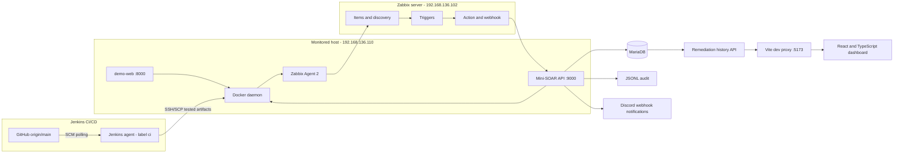
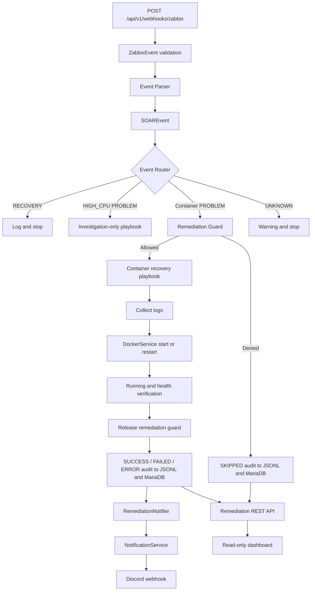

# Mini-SOAR Technical Architecture

## Scope and Status

Mini-SOAR is an isolated portfolio lab for event-driven monitoring and guarded self-healing. The repository implements infrastructure, detection, webhook ingestion, event routing, automated container recovery, verification, audit persistence, remediation REST APIs, a read-only security operations dashboard, and Discord remediation outcome notifications.

The design separates monitoring, decision, action, and evidence responsibilities. It is production-oriented in structure, but current runtime characteristics such as synchronous execution and in-memory guard state are appropriate for a single-node lab rather than a production control plane.

## System Context



The monitored host and Mini-SOAR engine currently share access to the local Docker daemon. That access is highly privileged and is a deliberate lab boundary.

## Control, Observability, and Notification Planes

```text
Control / automation plane
Zabbix -> webhook -> parser -> router -> guard -> playbook
        -> DockerService -> Docker -> verification -> release guard -> audit

Observability plane
MariaDB -> read-only FastAPI endpoints -> Vite development proxy
        -> React/TypeScript dashboard

Notification plane
Audited SUCCESS / FAILED / ERROR -> RemediationNotifier
        -> NotificationService -> Discord webhook

Delivery plane
GitHub -> Jenkins SCM polling -> isolated CI stack -> deployment gate
        -> tested image archive -> SSH/SCP -> lab Docker Compose
```

The dashboard belongs to the observability plane. Its source calls only remediation `GET` endpoints; it cannot invoke a playbook, start or restart a container, or execute a shell command. Discord is an outbound notification channel with no route back into remediation. The Zabbix webhook is the only application entry point to the automation plane.

## Layered Architecture

| Layer | Implementation | Responsibility |
|---|---|---|
| Detection | Zabbix Agent 2, Zabbix Server, triggers, and actions | Collect telemetry and emit managed problem/recovery events |
| Event ingestion | FastAPI `POST /api/v1/webhooks/zabbix` | Validate the Zabbix payload and enter the automation pipeline |
| Normalization and routing | `event_parser.py`, `router.py` | Map tags/state to `SOAREvent` and select the response policy |
| Remediation | `remediation_guard.py`, playbooks, `DockerService` | Enforce safety policy and perform allowlisted Docker actions |
| Verification | `DockerService.wait_until_healthy()` | Poll running and Docker health state after an action |
| Audit and persistence | `AuditService`, JSONL, MariaDB | Retain attempted outcomes and skipped guard decisions |
| REST API | `api/remediations.py` | Serve read-only history, summary, distribution, and detail data |
| Dashboard | React, TypeScript, Vite | Present remediation observability without control-plane actions |
| Notification | `RemediationNotifier`, `NotificationService`, Discord Webhook | Deliver selected remediation outcomes without propagating delivery failures |
| CI/CD | `Jenkinsfile`, `docker-compose.ci.yml`, deployment Compose | Validate, integration-test, package, transfer, deploy, verify, and conditionally roll back tested images |

## Mini-SOAR Internal Flow



## Component Responsibilities

| Component | Responsibility |
|---|---|
| `app/main.py` | Runs the monitored `demo-web` workload, health endpoint, and lab-only unhealthy simulation endpoints |
| Zabbix Agent 2 | Collects host and Docker telemetry from the monitored server |
| Zabbix Server | Stores telemetry, evaluates triggers, creates events, and invokes the webhook action |
| `api/zabbix.py` | Validates webhook payloads, logs normalized event details, and invokes routing |
| `services/event_parser.py` | Converts `ZabbixEvent` into the internal `SOAREvent` model |
| `playbooks/router.py` | Applies state and event-type routing policy |
| `services/remediation_guard.py` | Enforces event deduplication, per-container in-progress state, and successful-remediation cooldown |
| `playbooks/container_recovery.py` | Orchestrates evidence collection, Docker action selection, verification, guard release, audit, and notification policy |
| `playbooks/high_cpu.py` | Logs investigation-only behavior without restarting the workload |
| `services/docker_service.py` | Validates the container allowlist and runs fixed Docker CLI argument lists with timeouts |
| `services/audit_service.py` | Appends JSONL records and attempts MariaDB persistence |
| `services/database_service.py` | Executes parameterized MariaDB inserts and history queries |
| `services/notification_service.py` | Reads notification configuration, formats Discord embeds, sends the webhook with a timeout, and returns a structured result |
| `services/remediation_notifier.py` | Wraps notification delivery in an additional exception boundary |
| `api/remediations.py` | Exposes list/filter, summary, distribution, and event-ID lookup endpoints for remediation history |
| `frontend/src/services/api.ts` | Calls the list, summary, and distribution endpoints through relative `/api/v1` URLs |
| `frontend/src/pages/Dashboard.tsx` | Coordinates filters, loading/error state, manual refresh, and 15-second auto-refresh |
| `frontend/src/components/` | Renders KPI cards, distribution charts, and the remediation history table |
| `frontend/Dockerfile`, `frontend/nginx/` | Build the React assets and serve them through Nginx with `/api` reverse proxying |
| `docker-compose.yml` | Defines the three-container lab deployment and image-tag inputs |
| `docker-compose.ci.yml` | Defines the temporary MariaDB/application stack used for integration tests |
| `Jenkinsfile` | Implements SCM polling, validation, integration tests, artifact delivery, post-deploy checks, rollback, and cleanup |

## Package Boundaries

### `api/`

Owns HTTP transport concerns: request validation, query parameters, response models, and HTTP error mapping. API modules do not build Docker commands.

### `core/`

Defines transport-independent event and remediation record models. `EventType` and `EventState` are the shared vocabulary used by the parser, router, and playbooks.

### `playbooks/`

Owns response policy and workflow orchestration. The router decides which playbook applies; the container playbook coordinates services without embedding raw SQL or arbitrary shell construction.

### `services/`

Encapsulates integrations and stateful controls: Docker execution, guard state, JSONL audit, MariaDB access, and isolated Discord delivery.

### `frontend/`

Implements the read-only observability UI. The page composes presentation components and uses a typed API client; it contains no Docker service, remediation action, or playbook invocation.

## Data Flows

### Detection Flow

1. Zabbix Agent 2 collects Linux and Docker metrics.
2. Zabbix Server evaluates the configured `HIGH_CPU`, `CONTAINER_DOWN`, and `CONTAINER_UNHEALTHY` triggers.
3. A Zabbix Action forwards the event and its tags to the Mini-SOAR webhook.
4. FastAPI validates the payload as `ZabbixEvent`.
5. The parser maps `event_value == 1` to `PROBLEM`; any other value maps to `RECOVERY`.

### Routing and Recovery Flow

1. The router stops `RECOVERY` events after logging them.
2. `HIGH_CPU` problems enter the investigation-only playbook.
3. Container problems enter the remediation guard.
4. Unknown event types are logged without a remediation action.

### Remediation Flow

For `CONTAINER_DOWN`:

1. Acquire the guard for the event ID and service.
2. Collect recent container logs.
3. Inspect the container running state.
4. Run `docker start demo-web` when it is stopped.
5. Poll running state and Docker health for up to 90 seconds.

For `CONTAINER_UNHEALTHY`:

1. Acquire the same guard controls.
2. Collect recent container logs.
3. Restart the container when it is running; defensively start it if it has stopped before remediation.
4. Poll running state and Docker health for up to 90 seconds.

The demo workload stores its simulated unhealthy flag in process memory. A container restart resets that state and allows its `/health` endpoint to recover.

### Guard Flow

Guard checks execute atomically under a Python thread lock:

1. Remove deduplication entries older than 600 seconds.
2. Reject an already-acquired event ID as `duplicate_event`.
3. Reject another event for an active container as `remediation_in_progress`.
4. Reject a new event during the 60-second successful-remediation cooldown as `cooldown_active`.
5. Record the event ID and mark the container in progress only after the temporary checks pass.

The playbook releases the container in a `finally` block. Cooldown begins only when verification succeeds.

### Audit Flow

1. The playbook builds a record containing event, action, status, duration, and message fields.
2. `AuditService` appends the JSON record to `logs/remediation.jsonl` under a process-local thread lock.
3. It attempts a parameterized MariaDB insert into `remediation_history`.
4. MariaDB exceptions are logged and suppressed so a completed remediation does not become an application exception solely because database persistence failed.
5. The remediation API queries MariaDB for recent records or the latest record for an event ID.

### Notification Flow

For an acquired container remediation, `container_recovery.py` executes notification after releasing the guard and calling `AuditService.write()`:

1. `SUCCESS`, `FAILED`, and `ERROR` outcomes are passed to `RemediationNotifier`.
2. `SKIPPED` guard decisions are audited but return before notification, reducing duplicate, cooldown, and in-progress noise.
3. `NotificationService` checks `NOTIFICATIONS_ENABLED`, validates that `DISCORD_WEBHOOK_URL` is configured, and builds a Discord embed.
4. The embed contains event ID/type, service, host, status, action, duration, and optional details truncated to 1,000 characters.
5. The service sends an HTTP `POST` with a five-second timeout and returns a `NotificationResult` describing success, disabled/missing configuration, or a delivery error.

`NotificationService` handles Discord HTTP errors, connection errors, and unexpected exceptions. `RemediationNotifier` provides another exception boundary. A failed Discord request therefore does not change the established remediation status or roll back the preceding audit work.

There is no retry mechanism, persistent notification queue, or acknowledgement workflow.

### REST API Flow

The remediation router exposes four read-only history operations:

1. `GET /api/v1/remediations` returns up to 1-100 recent records and accepts optional `status` and `event_type` filters.
2. `GET /api/v1/remediations/summary` returns totals for each status, success rate, and the average duration of successful remediations.
3. `GET /api/v1/remediations/distribution` groups all records by status and event type.
4. `GET /api/v1/remediations/{event_id}` returns the latest matching record.

The API uses parameterized SQL for values and exposes MariaDB failures as HTTP `503`. Event lookup returns HTTP `404` when no record exists.

### Dashboard Flow

1. Vite serves the React development UI on port `5173` and proxies `/api` and `/health` to FastAPI at `127.0.0.1:9000`.
2. The dashboard requests summary, distribution, and a 10-row recent history concurrently.
3. Status and event-type selections are passed to the recent-history endpoint; summary and distribution remain global.
4. Data loads on initial render, after a filter change, on manual refresh, and every 15 seconds.
5. A successful load updates the timestamp and displays `Operational`. A failed dashboard request displays `API Unavailable` and an error message.

The operational indicator reflects the combined dashboard data requests; it does not independently poll the backend `/health` endpoint.

### CI/CD Flow

Jenkins runs on the `ci` agent and checks Git through two-minute SCM polling. It compiles the Python source, builds the React application, and builds three build-numbered images. `docker-compose.ci.yml` then provides an isolated MariaDB/application stack for service readiness, API, reverse-proxy, Docker socket, synthetic self-healing, and audit-persistence checks.

After CI succeeds, a gate requires the tested commit to equal `origin/main`. Jenkins packages the exact tested images with `docker save | gzip`, generates SHA256 and release metadata, then uses SSH/SCP to transfer them to `mini-soar-deploy@192.168.136.110:/opt/mini-soar`. The host verifies the checksum, runs `docker load`, and starts `docker-compose.yml` with `--no-build`.

Post-deployment checks cover all service health endpoints, dashboard API proxying, API database access, exact image tags, and build metadata. A failed deployment attempt before verification triggers restoration of previous Compose/image-tag metadata when available. See [CI/CD Pipeline](ci-cd.md) and [Lab Deployment](deployment.md).

## Safety Boundaries

- `DockerService` permits only `demo-web` by default.
- Docker commands are fixed argument lists passed to `subprocess.run`; webhook data is not evaluated by a shell.
- Each Docker command has a 15-second timeout.
- Container actions are followed by explicit state and health polling.
- Duplicate, lock, and cooldown denials are audited as `SKIPPED`.
- SQL values are passed as PyMySQL parameters.
- Runtime credentials come from environment variables and are excluded from Git.
- `RECOVERY` events never re-enter the remediation path.
- Dashboard code calls only read endpoints and has no direct Docker or playbook integration.
- The Vite proxy is development routing convenience and is not a security boundary.
- Discord receives outbound result messages only and cannot trigger remediation.
- The Discord webhook URL is loaded from the environment rather than embedded in source or documentation.
- Notification delivery is attempted only for `SUCCESS`, `FAILED`, and `ERROR`; notifier exceptions are contained.
- Jenkins deploys only when the tested SHA equals `origin/main`, verifies the transferred archive checksum, and uses SSH host-key checking.
- Deployment uses build-numbered images already exercised by CI and Compose `--no-build` on the target.

## Runtime and Failure Behavior

- Webhook processing is synchronous. A container event can keep the HTTP request open while verification runs for up to 90 seconds.
- Guard state is in memory and is not shared across multiple worker processes or retained after restart.
- JSONL writes occur before database inserts. A database outage is non-fatal to the remediation flow, but a local audit-file write error is not currently isolated.
- MariaDB is required for the remediation history endpoints; database failures are exposed as HTTP `503`.
- The webhook and remediation history endpoints do not currently implement authentication or authorization.
- Remediation API data is not access-controlled; the read-only UI prevents actions but does not provide confidentiality.
- The Python webhook handler does not enforce the `managed_by` tag; Zabbix Action filtering, network restriction, and the Docker allowlist are the current boundaries.
- There is no durable queue, retry scheduler, distributed lock, or circuit breaker.
- The lab deployment serves the built dashboard through Nginx on host port `8080`; the supplied configuration does not add TLS or authentication.
- Notifications are disabled by default and require a locally configured Discord webhook.
- Notification delivery is synchronous, has a five-second HTTP timeout, and has no retry or durable queue.
- Discord failure does not propagate into remediation, but delivery success is not persisted as a separate notification record.
- Deployment is a direct SSH/SCP lab workflow without a registry, signed images, SBOM, or environment promotion model.
- Rollback depends on retained image tags and previous metadata and does not repeat the full post-deployment verification suite.

These are documented constraints and candidates for later hardening, not capabilities claimed by the current implementation.

## Phase Status

| Phase | Scope | Status |
|---|---|---|
| 1 | Infrastructure and Docker workload | Complete |
| 2 | Zabbix monitoring and detection | Complete |
| 3 | Webhook ingestion, parsing, and routing | Complete |
| 4 | Guarded remediation, verification, audit, persistence, and history API | Complete |
| 5 | Read-only React/TypeScript security operations dashboard | Complete |
| 6 | Discord remediation outcome notifications | Complete |
| CI/CD | Jenkins validation, integration testing, lab deployment, and rollback | Complete |
| Current | Portfolio documentation and evidence | In progress |
| Future | Additional security hardening and deployment maturity | Planned |
