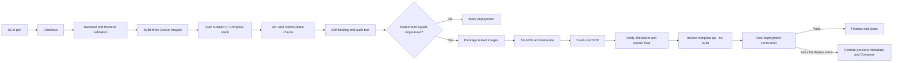

# CI/CD Pipeline

## Scope

The repository uses a declarative `Jenkinsfile` on an agent labeled `ci`. Jenkins checks Git with `pollSCM('H/2 * * * *')`; this is SCM polling approximately every two minutes, not a GitHub webhook.

The pipeline is limited to the controlled lab. It validates the application, tests the exact Docker images it built, packages those images, and deploys them to the lab host only after a branch gate.

## Pipeline Overview

## Exact Stage Order

1. `Checkout`
2. `Environment Check`
3. `Backend Dependencies`
4. `Backend Validation`
5. `Frontend Dependencies`
6. `Frontend Build`
7. `Build Docker Images`
8. `Validate CI Compose`
9. `Start CI Stack`
10. `Wait For Services`
11. `API Smoke Tests`
12. `Docker Control Plane Check`
13. `Self-Healing Smoke Test`
14. `Verify Audit Persistence`
15. `Deployment Gate`
16. `Package Deployment Artifacts`
17. `Transfer Deployment Artifacts`
18. `Deploy to Lab Server`
19. `Post-Deployment Verification`
20. `Finalize Deployment`
21. `Build Summary`

The `post` section conditionally runs rollback on deployment failure and always removes the temporary CI stack, build images, old builder cache, virtual environment, deployment artifacts, and Jenkins workspace.

## Continuous Integration

### Tooling and dependencies

`Environment Check` verifies Python, pip, Node.js, npm, Docker, Docker Compose, curl, and SSH. Backend dependencies are installed into `.jenkins-venv`; frontend dependencies use `npm ci`.

### Static/build validation

- Python: `python -m compileall src app` and `python -m pip check`.
- Frontend: TypeScript/Vite production build via `npm run build`.
- Compose: `docker compose -f docker-compose.ci.yml config`.

### Docker images

The pipeline builds once and assigns build-number tags:

| Image variable | Tag pattern | Dockerfile |
|---|---|---|
| `DEMO_WEB_IMAGE` | `mini-soar-demo-web:${BUILD_NUMBER}` | `docker/demo-web.Dockerfile` |
| `MINI_SOAR_API_IMAGE` | `mini-soar-api:${BUILD_NUMBER}` | `docker/mini-soar.Dockerfile` |
| `DASHBOARD_IMAGE` | `mini-soar-dashboard:${BUILD_NUMBER}` | `frontend/Dockerfile` |

### Isolated CI stack

`docker-compose.ci.yml` starts:

- MariaDB on the Compose network;
- `demo-web` on host port `18000`;
- Mini-SOAR API on host port `19000` with the Docker socket mounted;
- Nginx dashboard on host port `18080`.

Notifications are explicitly disabled in CI. MariaDB credentials in this file are fixed test-only values for the ephemeral stack, not deployment credentials.

### Integration coverage

The pipeline verifies:

- workload, API, and dashboard readiness;
- OpenAPI availability;
- API-to-MariaDB connectivity;
- Nginx dashboard reverse proxy to the API;
- Docker client/server compatibility from inside `mini-soar-api`;
- visibility of the allowlisted `demo-web` container through the socket;
- self-healing after stopping `demo-web` and posting a synthetic `CONTAINER_DOWN` Zabbix event;
- persisted audit lookup with `status=SUCCESS` and `action=start`.

## Deployment Gate

Before packaging, Jenkins fetches `origin/main` and compares its SHA with the tested checkout. Deployment stops unless the two commits are identical. This prevents a non-main or stale tested revision from reaching the deployment host.

This gate is a branch/commit safety check; it is not a manual approval step.

## Build Once, Deploy the Tested Artifact

The pipeline does not rebuild on the deployment host:

1. Save the three tested images with `docker save` and gzip them into `mini-soar-images.tar.gz`.
2. Generate `mini-soar-images.tar.gz.sha256`.
3. Package `docker-compose.yml`, `.deploy.env` image tags, and non-secret `deployment.env` metadata.
4. Stash the complete artifact set for stage restart and archive only `deployment.env` in Jenkins.
5. Transfer the package over SCP.
6. Verify SHA256 on the target, stream the archive into `docker load`, validate Compose, and run `docker compose up -d --no-build`.

This preserves artifact identity between CI and CD. SHA256 detects corruption or unintended changes in transit; it does not provide image signing or publisher authenticity.

## Deployment and Verification

Jenkins uses the credential ID `mini-soar-deploy-ssh` through `sshagent` and connects as `mini-soar-deploy` to `192.168.136.110:/opt/mini-soar`. SSH uses batch mode and `StrictHostKeyChecking=yes`.

The target `.env` must already exist and is not copied by Jenkins. Post-deployment verification checks:

- `demo-web` at `:8000/health`;
- Mini-SOAR API at `:9000/health`;
- dashboard Nginx at `:8080/healthz`;
- dashboard-to-API reverse proxy;
- direct API-to-MariaDB query;
- exact image tags on all three containers;
- `BUILD_NUMBER` in `deployment.env`;
- remote `docker ps` state for evidence.

## Automatic Rollback

Before transfer, Jenkins backs up an existing `.deploy.env`, `docker-compose.yml`, and `deployment.env` using `.previous` filenames. Rollback runs only when `DEPLOY_ATTEMPTED=true` and `DEPLOY_VERIFIED` has not become `true`.

The rollback procedure:

1. Requires previous image-tag and Compose metadata.
2. Runs the previous Compose configuration with `up -d --no-build`.
3. Restores the previous active metadata files.
4. Waits ten seconds and displays `docker compose ps`.

If no previous metadata exists or rollback itself fails, Jenkins reports that manual recovery may be required. The current rollback path does not repeat the full post-deployment health and image-version verification suite.

## Jenkins Controls and Limits

- Concurrent builds are disabled for this job.
- Total pipeline timeout is 30 minutes.
- Five stashes and 20 build records are retained.
- SSH private material remains in Jenkins credentials, not in the repository.
- Deployment is a direct lab transfer; there is no container registry, signed image, SBOM, or promotion environment.
