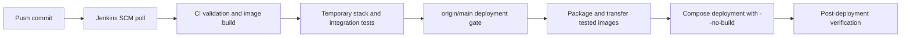

# Demo Runbook

## Purpose

This 3-5 minute runbook demonstrates detection, event-driven remediation, audit persistence, dashboard visibility, and optional Discord notification in the isolated lab.

> Run fault-injection commands only against the dedicated `demo-web` lab workload.

## Prerequisites

- Zabbix is monitoring `demo-web` and its webhook action is enabled.
- `demo-web`, `mini-soar-api`, and `mini-soar-dashboard` are running.
- MariaDB is reachable by the API.
- The browser can reach `http://192.168.136.110:8080`.
- Discord notification is optional and must be configured only in the deployment host `.env`.

## Self-Healing Demo

### 1. Establish the healthy baseline

Run on the deployment host:

```bash
docker ps \
  --filter name=demo-web \
  --filter name=mini-soar-api \
  --filter name=mini-soar-dashboard

curl -fsS http://127.0.0.1:8000/health
curl -fsS http://127.0.0.1:9000/health
curl -fsS http://127.0.0.1:8080/healthz
```

Open the dashboard at `http://192.168.136.110:8080` and note the current remediation count.

### 2. Inject an unhealthy state

```bash
./scripts/container_unhealthy.sh
```

This sends `POST http://localhost:8000/simulate/unhealthy`. The workload stores the flag in memory and begins returning HTTP `503` from `/health`; it does not create a host file.

### 3. Observe detection and event delivery

Wait for Docker health to become `unhealthy` and for the Zabbix `CONTAINER_UNHEALTHY` trigger/action to deliver its webhook. Follow API logs:

```bash
docker logs -f mini-soar-api
```

Expected log sequence:

1. normalized `PROBLEM` event;
2. remediation guard acquisition;
3. pre-remediation log collection;
4. `docker restart demo-web`;
5. running/health polling;
6. `SUCCESS` audit;
7. notification attempt when enabled.

### 4. Verify recovery

```bash
docker inspect demo-web \
  --format 'running={{.State.Running}} health={{.State.Health.Status}}'
curl -fsS http://127.0.0.1:8000/health
```

Restarting the application resets the in-memory fault, so the expected state is `running=true`, `health=healthy`, and HTTP `200`.

### 5. Verify audit and dashboard

Query the most recent unhealthy remediation:

```bash
curl -fsS \
  'http://127.0.0.1:9000/api/v1/remediations?limit=5&event_type=CONTAINER_UNHEALTHY'
```

Confirm a `SUCCESS` record with `action=restart`, then refresh the dashboard or wait for its 15-second automatic refresh.

If notifications are enabled, confirm the Discord embed contains the event type, service, status, action, host, duration, and details. Do not expose the webhook URL while recording evidence.

## Alternative Container-Down Demo

```bash
./scripts/container_down.sh
```

Expected flow: Zabbix detects `CONTAINER_DOWN`, Mini-SOAR runs `docker start demo-web`, verifies health, writes `SUCCESS/action=start`, and optionally notifies Discord.

Do not manually start the container during this end-to-end test. If automation is unavailable, recover with `docker start demo-web`.

## Guard Demonstration

Repeated delivery of an acquired event ID produces a `SKIPPED` audit with `duplicate_event`. A second event can also be skipped while remediation is in progress or during the 60-second cooldown. These decisions appear in history but do not generate Discord notifications.

## CI/CD Demo



Jenkins polls approximately every two minutes. In the Jenkins console, show the self-healing/audit stages, deployment gate, artifact SHA256, deployed image version checks, and final build summary. Do not describe this trigger as a GitHub webhook.

## Screenshot Checklist

- [x] Zabbix trigger — `docs/images/07-container-down&unhealthy-problem.png` proves the container incident detection.
- [x] Self-healing logs — `docs/images/18-container-unhealthy-self-healing.png` proves restart, verification, audit, and guard behavior.
- [x] Jenkins validation and build stages — `docs/images/24-jenkins-ci-foundation.png`.
- [x] Jenkins test, deployment, and final stages — `docs/images/25-jenkins-final-pipelines.png`.
- [x] Dashboard — `docs/images/21-mini-soar-dashboard.png` proves KPI, analytics, history, refresh, and API state.
- [x] Audit record — `docs/images/19-remediation-history-db.png` proves MariaDB persistence; `20-remediation-api.png` proves API retrieval.
- [x] Deployment state — `docs/images/26-production-containers.png` proves the three build-numbered containers are healthy.
- [x] Deployment metadata — `docs/images/27-deployment-metadata.png` proves the build, commit, archive checksum, and image-tag metadata without exposing `.env`.
- [x] Discord outcome — `docs/images/23-discord-remediation-success.png` proves a successful outbound notification without exposing its webhook URL.

All listed evidence is captured from the lab. Keep future screenshots factual and do not create or commit fabricated evidence.
