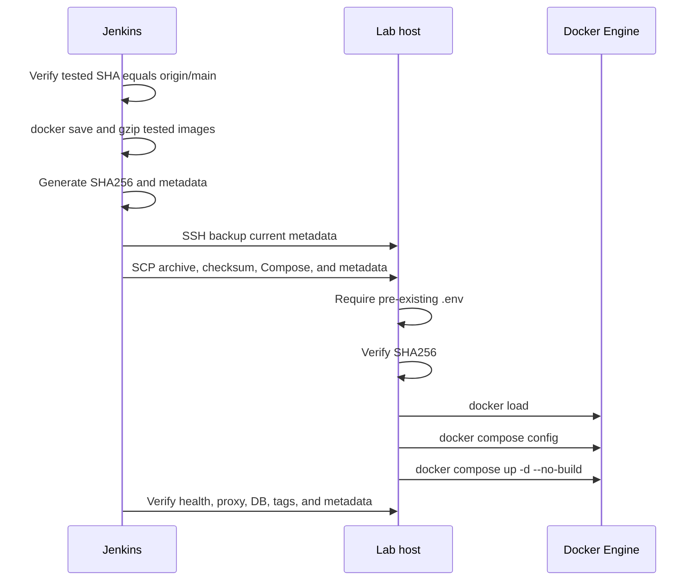
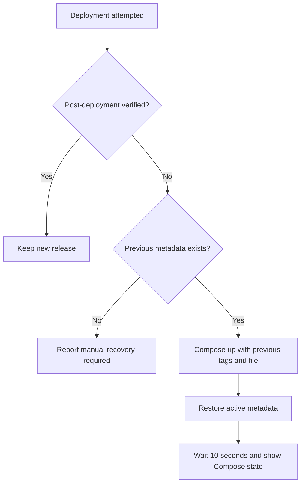

# Lab Deployment

## Scope

Jenkins deploys the exact Docker images validated by CI to a Linux lab host. This is a direct SSH/SCP deployment intended for portfolio demonstration, not a production release platform.

## Architecture

```mermaid
flowchart LR
    subgraph Jenkins[CI node - label ci]
        A[Tested Docker images]
        B[Compressed image archive]
        C[SHA256 and release metadata]
        A --> B --> C
    end

    subgraph Target[Lab deployment host - 192.168.136.110]
        D[/opt/mini-soar]
        E[Docker Engine]
        F[demo-web :8000]
        G[mini-soar-api :9000]
        H[mini-soar-dashboard :8080]
        D --> E
        E --> F
        E --> G
        E --> H
    end

    C -->|SSH and SCP as mini-soar-deploy| D
```

## Deployment Identity and Access

| Setting | Current value |
|---|---|
| Jenkins node | Agent label `ci` |
| Deployment host | `192.168.136.110` |
| Deployment account | `mini-soar-deploy` |
| Remote directory | `/opt/mini-soar` |
| Jenkins credential ID | `mini-soar-deploy-ssh` |
| SSH host verification | `StrictHostKeyChecking=yes` |

The deployment account must be able to create/use `/opt/mini-soar` and run the Docker and Docker Compose commands used by the pipeline. If Docker access is provided through membership in the host `docker` group, treat that membership as root-equivalent privilege.

The SSH private key and known-host trust material are managed outside Git. The repository contains only the Jenkins credential identifier.

## Runtime Compose Architecture

`docker-compose.yml` deploys three containers:

| Container | Image variable | Networking and port | Purpose |
|---|---|---|---|
| `demo-web` | `DEMO_WEB_IMAGE` | `8000:8000` | Monitored workload and lab fault target |
| `mini-soar-api` | `MINI_SOAR_API_IMAGE` | Host network, API on `9000` | Event ingestion, remediation, audit, and notification |
| `mini-soar-dashboard` | `DASHBOARD_IMAGE` | `8080:80` | Nginx-served React dashboard and `/api` reverse proxy |

The API uses host networking because MariaDB is currently host-local and `DB_HOST=127.0.0.1` remains valid. It mounts `/var/run/docker.sock` so `DockerService` can operate the allowlisted `demo-web` container.

The dashboard sets `API_UPSTREAM=http://host.docker.internal:9000` and maps `host.docker.internal` through Docker's host gateway.

## Files on the Deployment Host

| File | Source and purpose |
|---|---|
| `.env` | Pre-provisioned on the target; contains database/notification configuration and is never transferred by Jenkins |
| `.deploy.env` | Generated image tags for the current build |
| `deployment.env` | Non-secret build number, commit SHA, timestamp, archive checksum, and image tags |
| `docker-compose.yml` | Compose definition transferred from the tested checkout |
| `mini-soar-images.tar.gz` | Compressed archive of the three tested images; removed after successful deployment |
| `mini-soar-images.tar.gz.sha256` | Integrity checksum; removed after successful deployment |

Previous `.deploy.env`, Compose, and deployment metadata are retained with `.previous` names before new artifacts are copied.

## Deployment Sequence



No image build runs on the deployment host. The image tags in `.deploy.env` select the build-number images loaded from the verified archive.

## Post-Deployment Verification

Jenkins performs up to 30 attempts with two-second intervals for each service health check. It then validates API connectivity through both Nginx and port `9000`, compares each running container's image to the expected build tag, verifies the build number in `deployment.env`, and prints a filtered `docker ps` table.

The deployment is marked verified only after all checks pass. On success, the remote archive/checksum are removed and dangling images are pruned.

## Automatic Rollback



Rollback preserves the original pipeline failure. It does not load missing older images, so those image tags must still exist on the deployment host. It also does not run the complete health/version verification suite after restoring the previous Compose state.

## Manual Inspection

On the deployment host:

```bash
cd /opt/mini-soar
docker compose --env-file .deploy.env -f docker-compose.yml ps
docker inspect demo-web mini-soar-api mini-soar-dashboard \
  --format '{{.Name}}={{.Config.Image}} {{.State.Status}}'
curl -fsS http://127.0.0.1:8000/health
curl -fsS http://127.0.0.1:9000/health
curl -fsS http://127.0.0.1:8080/healthz
```

Do not print `.env` or copy it back into the repository while collecting deployment evidence.
