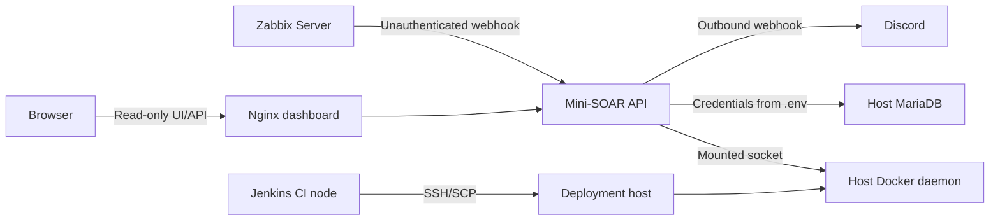

# Security Model

## Scope

Mini-SOAR is a controlled lab that demonstrates security automation controls and their tradeoffs. It is not hardened production infrastructure, and access to the Docker daemon remains the most significant trust boundary.

## Security Controls

### Remediation controls

- Container operations are limited by an application allowlist containing only `demo-web`.
- Docker CLI commands use fixed subprocess argument lists rather than `shell=True` or shell-interpolated webhook values.
- Docker subprocesses time out after 15 seconds.
- Duplicate event IDs are retained for 600 seconds.
- A per-container lock prevents overlapping remediation in one API process.
- A 60-second cooldown follows verified success.
- Recovery is verified from Docker running and health state.
- `RECOVERY`, `UNKNOWN`, and `HIGH_CPU` events do not perform container remediation.

### Data and interface controls

- Database values use PyMySQL parameters.
- JSONL audit is written before MariaDB persistence is attempted.
- The React dashboard calls read-only remediation endpoints and has no Docker or playbook control.
- Discord is an outbound notification path; delivery errors are isolated from remediation.
- CI disables notifications explicitly.

### CI/CD controls

- Jenkins deployment runs only when the tested commit equals `origin/main`.
- The three images are built once, exercised by the CI stack, then packaged for deployment without rebuilding.
- SHA256 is verified before `docker load` on the target.
- Deployment uses a dedicated `mini-soar-deploy` account and Jenkins-managed SSH credential ID `mini-soar-deploy-ssh`.
- SSH uses batch mode and `StrictHostKeyChecking=yes`.
- The target `.env` remains on the deployment host and is not included in deployment artifacts.
- Exact deployed image tags and build metadata are verified after Compose starts.
- Previous deployment metadata supports automatic rollback when deployment begins but verification fails.

## Trust Boundaries

### Docker socket

`mini-soar-api` mounts `/var/run/docker.sock`. A process with Docker API access can normally create privileged containers, mount host filesystems, or otherwise control the Docker host. The application allowlist reduces accidental remediation scope but does not provide production-grade isolation if the API process is compromised.

The Jenkins CI API container mounts the same socket to validate the Docker control plane and self-healing flow. Run this pipeline only on a dedicated lab CI node.

### Deployment account

The pipeline invokes `docker` remotely without `sudo`, so `mini-soar-deploy` must have Docker daemon access. When implemented with the Docker group, this is effectively root-equivalent. Limit SSH key use, restrict the account and host, and monitor access outside this portfolio lab.

### Network interfaces

- The Zabbix webhook and remediation history endpoints currently have no application authentication or authorization.
- The Python handler does not enforce the `managed_by` tag; Zabbix Action filtering and network policy must restrict intended senders.
- The Nginx configuration supplies static hosting and API proxying but no TLS, authentication, rate limiting, or security headers beyond its defaults.
- The deployed API uses host networking, increasing its exposure to host-local services.
- Discord receives event metadata including host, service, action, status, duration, and details.
- `192.168.136.110` is a private lab address, not a credential or an Internet-routable endpoint. It still reveals internal addressing, so replace it with a documentation placeholder before publication if lab-topology privacy is required.

## Secrets

Never commit or publish:

- `.env` or environment-specific copies;
- MariaDB passwords;
- a Discord webhook URL;
- SSH private keys or known-host management secrets;
- Jenkins credentials, tokens, or exported credential stores.

The repository contains variable names, placeholders, a Jenkins credential identifier, and fixed MariaDB values for the ephemeral CI Compose stack. Those CI values are not deployment credentials and should not be reused outside CI.

Relevant ignore rules cover `.env*` except `.env.example`, virtual environments, Python caches, logs, frontend dependencies/builds, `.jenkins-venv/`, and `deploy-artifacts/`.

## Artifact Integrity

The SHA256 file detects archive corruption or modification between Jenkins packaging and remote loading. It is transferred beside the archive over the same SSH channel and is not a digital signature. Signed images, attestations, provenance, and an SBOM are future hardening opportunities.

## Known Limitations

- No webhook/API authentication, RBAC, or operator acknowledgement workflow.
- No TLS configuration is provided for the lab HTTP endpoints.
- In-memory guard state is not shared or durable.
- No notification retry queue.
- No container registry, image signing, vulnerability scanning, or SBOM generation.
- Rollback depends on previous metadata and locally retained image tags.
- Rollback does not perform the complete post-deployment verification suite.
