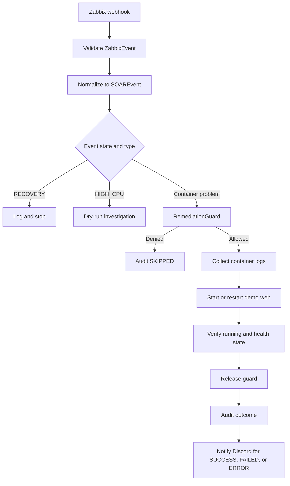

# Self-Healing Workflows

## Scope

Mini-SOAR performs narrowly scoped Docker recovery for two Zabbix `PROBLEM` event types. `HIGH_CPU` is investigation-only, and `RECOVERY` events are logged without remediation.

## Event Validation and Routing

`POST /api/v1/webhooks/zabbix` validates the request with `ZabbixEvent`. `event_parser.py` reads the `event_type` and `service` tags, maps `event_value == 1` to `PROBLEM`, and maps other values to `RECOVERY`.

`router.py` then applies the response policy:

| Event | Current policy |
|---|---|
| `CONTAINER_DOWN` | Guarded container recovery |
| `CONTAINER_UNHEALTHY` | Guarded container recovery |
| `HIGH_CPU` | Log a dry-run investigation; no Docker action or remediation audit |
| `UNKNOWN` | Warn and stop |
| Any `RECOVERY` | Log and stop |

## `CONTAINER_DOWN`

1. Require a `service` tag.
2. Acquire the guard for the event ID and service.
3. Collect the last 50 lines of container logs.
4. Inspect the allowlisted container.
5. Run `docker start demo-web` when stopped; use `action=none` when it is already running.
6. Poll running state and Docker health every five seconds for up to 90 seconds.
7. Release the guard, starting cooldown only after verified success.
8. Append JSONL audit and attempt the MariaDB insert.
9. Attempt Discord notification for `SUCCESS`, `FAILED`, or `ERROR`.

## `CONTAINER_UNHEALTHY`

1. Require a `service` tag and acquire the same guard controls.
2. Collect the last 50 lines of logs before changing the container.
3. Run `docker restart demo-web` when the container is running.
4. Defensively run `docker start demo-web` if it stopped before remediation began.
5. Poll running and health state for up to 90 seconds.
6. Release the guard, audit the result, and apply the same notification policy.

The demo workload stores its simulated unhealthy state in process memory. Restarting the container resets that state, which is suitable for this controlled lab scenario.

## Remediation Guard

Guard checks run under a Python thread lock in this order:

1. Remove event IDs older than the 600-second TTL.
2. Reject an acquired event ID as `duplicate_event`.
3. Reject another active remediation for the container as `remediation_in_progress`.
4. Reject a new event during the 60-second post-success cooldown as `cooldown_active:<seconds>s`.
5. Record the accepted event ID and mark the container in progress.

Events rejected by the in-progress or cooldown checks are not consumed, allowing a later retry. Guard state is in memory, per process, and lost when the API restarts.

## Docker Safety Controls

- `DockerService.allowed_containers` currently contains only `demo-web`.
- Commands use fixed subprocess argument lists, not shell-evaluated webhook data.
- Each Docker CLI call has a 15-second timeout.
- Recovery is verified through Docker running and health state.
- The Mini-SOAR API container reaches the host Docker daemon through `/var/run/docker.sock`.

## Outcomes, Audit, and Notifications

| Status | Meaning | Discord notification |
|---|---|---|
| `SUCCESS` | Recovery action or no-op state was verified healthy | Yes |
| `FAILED` | Docker action or health verification did not succeed | Yes |
| `ERROR` | An exception occurred during the acquired remediation workflow | Yes |
| `SKIPPED` | The guard denied duplicate, in-progress, or cooldown work | No |

Audit is written to `logs/remediation.jsonl` before a parameterized insert into MariaDB `remediation_history`. Database failures are logged and suppressed after the JSONL write. Notification happens after the audit call and is separately isolated so Discord failure cannot change the remediation outcome.

## Current Limitations

- Webhook processing and remediation are synchronous.
- Guard state is neither durable nor shared between workers.
- There is no remediation retry scheduler, attempt budget, or circuit breaker.
- Notification has no retry queue or acknowledgement workflow.
- Docker socket access gives the API significant control over the host; the allowlist is an application control, not host isolation.
